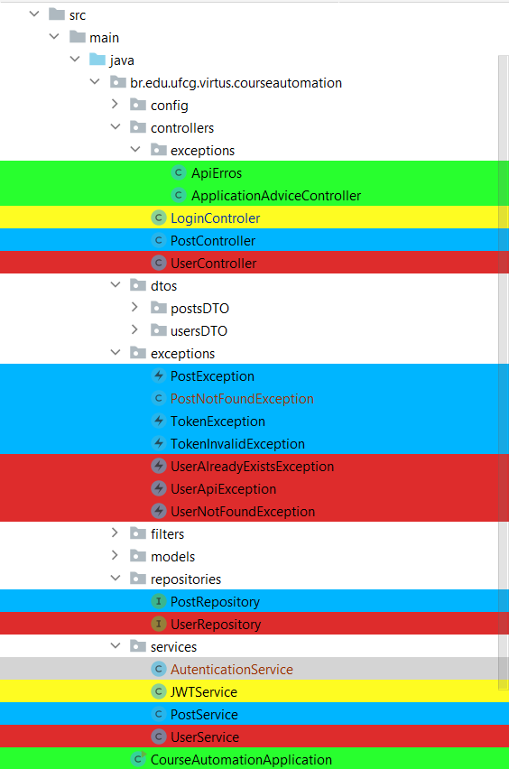

# Artifact Priority Sorter for [Tracy-TD](https://tracy-td.github.io/)

## Plugin for [JetBrains IDE](https://www.jetbrains.com/).

Highlights project files in color according to their **Tracy-TD** classification.

## 📝 Objective

When the developer is working,
it is necessary for him to realize which artifacts are most important to the business

The plugin allows the IntelliJ interface to classify artifacts with colors,
according to their criticality for the business.
The colors of the artifacts are changed according to the level
of priority and impact on the business.

## Priority Classification By Color

| Color  | Classification |
|--------|----------------|
| Red    | Critical       |
| Yellow | High           |
| Blue   | Medium         |
| Green  | Low            |

## ▶ Install

All instructions can be found
at [Install plugins](https://www.jetbrains.com/help/idea/managing-plugins.html#install_plugin_from_disk).

## ✨ Expected Result

## 🔗 Resources

- Quick Start Guide https://plugins.jetbrains.com/docs/intellij/basics.html
- Main types of Plugins https://plugins.jetbrains.com/docs/intellij/types-of-plugins.html
- IntelliJ Platform Plugin Template https://github.com/JetBrains/intellij-platform-plugin-template
- Extensions Explorer https://plugins.jetbrains.com/intellij-platform-explorer
- UI Guidelines https://jetbrains.design/intellij/
- Plugin Configuration File https://plugins.jetbrains.com/docs/intellij/plugin-configuration-file.html
- Actions https://plugins.jetbrains.com/docs/intellij/basic-action-system.html
- Extensions https://plugins.jetbrains.com/docs/intellij/plugin-extension-points.html#using-extension-points
- Gradle IntelliJ Plugin tasks https://github.com/JetBrains/gradle-intellij-plugin#tasks
- Tracy-TD https://tracy-td.github.io/

## Community

## License

[MIT License](./LICENSE)    