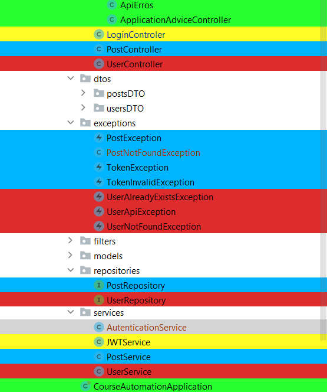

# Artifact Priority Sorter for Tracy-TD
##  Plugin for Jetbrains IDEs. 
Highlights project files in color according to their **Tracy-TD** classification.

When the developer is working,
it is necessary for him to realize which artifacts are most important to the business

The plugin allows the IntelliJ interface to classify artifacts with colors,
according to their criticality for the business.
The colors of the artifacts are changed according to the level
of priority and impact on the business.

## Priority Classification By Color

| Color                                          | Classification |
|------------------------------------------------|----------------|
| <strong style="color:red"> Red </strong>       | Critical       |
| <strong style="color:yellow"> Yellow </strong> | High           |
| <strong style="color:blue"> Blue </strong>     | Medium         |
| <strong style="color:green"> Green </strong>   | Low            |

## After prioritization, the artifacts looked like:

